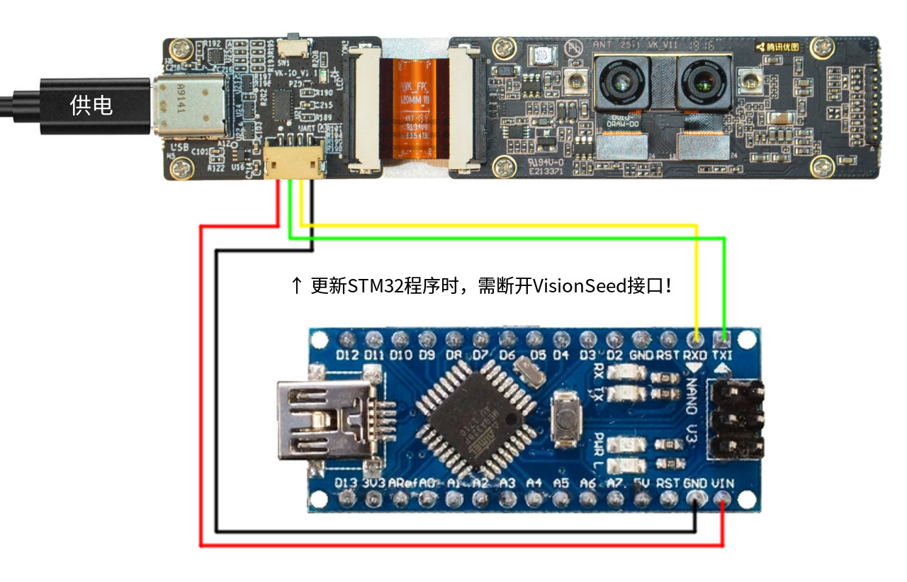
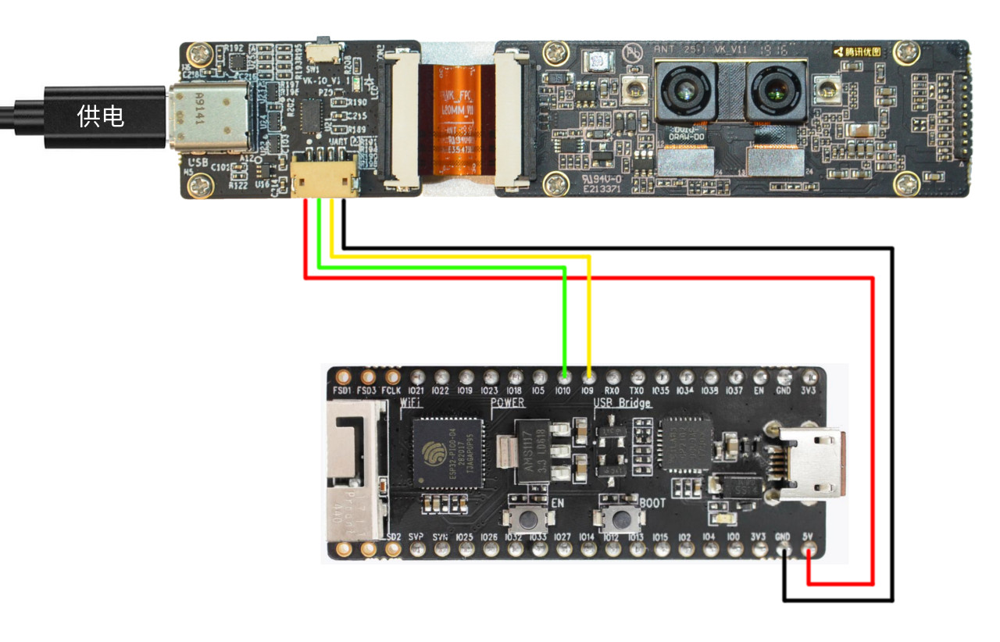

### arduino-sdk for VisionSeed - a camera module with AI ability

---

腾讯优图VisionSeed，是一个融AI算法+运算能力+摄像头为一体的硬件模组，致力于向硬件开发者提供世界领先的AI能力，通过VisionSeed可轻松使用优图人脸检测、识别、配准、姿态、属性等能力。

VisionSeed的开发团队觉得AI加上Arduino能够碰撞出有意思的火花，特意制作了这个SDK，通过UART接口，把AI分析的结果，输出到Arduino，开发AI应用触手可及。

本SDK可用于基于AVR单片机的传统Arduino硬件，也可使用第三方制作的“Arduino附加开发板”在ESP32和STM32单片机中运行，验证过的硬件包括：
- Arduino Nano (Atmega328, 2KB RAM)
- Arduino Uno (Atmega328, 2KB RAM)
- Blue Pill (STM32duino, STM32F103, 20KB RAM)
- Black Pill (STM32duino, STM32F103, 20KB RAM)
- ESP32 WROOM (ESP32 Arduino, ESP32, 512KB RAM, WiFi/Bluetooth)

此SDK需配合V1.2.3及以上版本固件使用，请通过官网的VisionSeed配置工具升级固件。

# run example
1. 下载visionseed.zip库
2. 导入：打开ArduinoIDE，项目->加载库->添加.ZIP库
3. 打开例程
 - 对于传统的Arduino开发板，运行：example.ino
 - 对于基于ESP32或STM32的开发板，运行：example-ext.ino
4. 硬件连接：通过4PIN-ZH1.5插座引出VisionSeed UART接口，连接到开发板对应引脚
 - Arduino Nano开发板：

 - ESP32-Pico开发板：

# more
Homepage: https://visionseed.youtu.qq.com

技术交流QQ群: 684338220(超多大佬)
